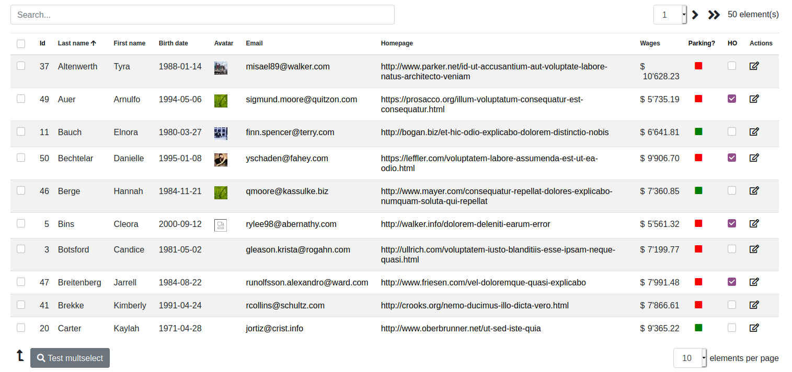

# TableBuilder

[By Sébastien L'haire](http://sebastien.lhaire.org)

A Laravel library to build tables easily, which interacts with a lightweight js builder and builds data from Eloquent Object-Relational Mapping with database tables, or can be used with static data.

It uses:

* a Javascript table builder based on [jQuery](https://jquery.com/) Javascript framework.
* [Moment.js](https://momentjs.com/) date utils library.
* [Bootstrap](https://getbootstrap.com/) 4 or 5 CSS Framework.
* [FontAwesome](https://fontawesome.com/) icons



Data are automatically paginated and can be searched and sorted. You can also easily add other
parameters to select data. Demo site available [here](https://sebastien.lhaire.org/paginator).

## Installation

1. `composer require seblhaire/tablebuilder`

2. Composer will automatically link the package with Laravel. But you still can explicitely add provider and facade to your `config/app.php`:
```php
  'providers' => [
    ...
      Seblhaire\TableBuilder\TableBuilderHelperServiceProvider::class,
      ...
    ],
    'aliases' => [
        ...
        "TableBuilderHelper" => Seblhaire\TableBuilder\TableBuilderHelper::class
      ]
```

3. Publish package (optionally).
``` sh
$ php artisan vendor:publish
```

4. For Javascript and stylesheets, see next section.

## Javascript ans stylesheets

On a webpage, every JS library and CSS stylesheets can be linked separately. If you choose this classical way, first dowload and install above mentionned libraries or use Content Delivery Network (CDN) links as in the example page in last section. Then publish package files as explained above and put following tags in your template:

```html
<script type="text/javascript" src="js/vendor/seblhaire/tablebuilder/tablebuilder.js"></script>
<link rel="stylesheet" type="text/css" property="stylesheet" href="css/vendor/seblhaire/tablebuilder/tablebuilder.css"/>
```

But websites often use many libraries and stylesheets and browser must download many files before the site can be rendered properly. Modern websites come with a single compressed Javascript file which concatenates necessary scripts; same principle for stylesheets. With Laravel you can use [Laravel Mix](https://github.com/JeffreyWay/laravel-mix) to compile files.

Use [NPM](https://www.npmjs.com/) package manager :
`npm install bootstrap jquery moment @fortawesome/fontawesome-free`

Then your js source file should be something like this:

```js
global.jQuery = require('jquery');
var $ = global.jQuery;
var jQuery = global.JQuery;
window.$ = $;
window.jQuery = jQuery;
require('bootstrap');
global.moment = require('moment');
require('../../vendor/seblhaire/tablebuilder/resources/js/tablebuilder.js');
```

For your stylesheet:

```css
@import '~bootstrap/scss/bootstrap';
@import "~@fortawesome/fontawesome-free/scss/fontawesome";
@import "~@fortawesome/fontawesome-free/scss/regular";
@import "~@fortawesome/fontawesome-free/scss/solid";
@import "~@fortawesome/fontawesome-free/scss/brands";

@import "../../vendor/seblhaire/tablebuilder/resources/css/tablebuilder";
```

## Configuration file

Table Builder library is customizable. Default values can be changed, either in configuration file, or by passing options in Facade function (see next section). If you want to modify default configuration file, publish package files and access to `config/tablebuilder.php`.

## Usage

TableBuilder package comes with a simple Facade.

### TableBuilderHelper::initTable

Inits a table object that can be passed to the view.

`TableBuilderHelper::initTable($objectId,  $url, $options)`

where:

* `$objectId`: id of `<div>` tag where the table must be inserted.
* `$url`: route that must be used to load data. Set empty if static data.
* `$options` : array of options.
  * `'searchable'`: insert a search field in top of table. Default `true`.
  * `'itemsperpage'`: default item number per page. 0 for no pagination. Default `20`.
  * `'pagechoices'`: choices of items per page.
  * `'encoding'`: encoding of data. Default `'utf8'`.
  * `'additionalparams'`: static additional parameters to pass to query.
  * `'paramsFunction'`: name of function to pass dynamic additional params, e.g. form content.
  * `'tableClass'`: class(es) of `<table>`: default `'TableBuilder table table-condensed table-hover table-striped'`.
  * `'headersclass'`: class(es) for `<div>` set before table for search input and pagination. Default `'TableBuilderHeads'`.
  * `'searchdivclass'`: class(es) for `<div>` containing search input. Default: `'TableBuilderSearch form-group'`.
  * `'searchresetbuttondivclass'`:   class(es) for `<div>` containing search input reset button. Default: `input-group-append`.
  * `'searchresetbuttonclass'`: search input reset button class(es). Default: `btn btn-outline-secondary`
  * `'eltspageclass'`: class(es) for bottom `<div>`. Default: `'TableBuilderEltsPage'`.
  * `'paginationclass'`:  class(es) for `<div>` containig table pagination. Default: `'TableBuilderPagination'`.
  * `'pagecontclass'`:  class(es) for `<div>` containing elements per page. Default: `'TableBuilderEltPageCont'`.
  * `'bottomclass'`:  class(es) for bottom `<div>` containing  buttons. Default: `'TableBuilderBottom'`.
  * `'footerclass'`: class(es) for footer to be displayed after data lines.  Default: `'TableBuilderFooter'`.
  * `'buttonclass'`: default class for action buttons. Default: `'btn btn-secondary'`.
  * `'rowcontextualtrigger'`: name of special field in data to trigger use of a special class for some rows. Default: `trclass`. See details [below](#addmethod).
  * `'ajaximgname'`: FontAwesome classes to display hourglass displayed when table data is loading. Default: `'far fa-hourglass'`.
  * `'uparrow'`: FontAwesome classes to display up arrow displayed on sortable column. Default: `'fas fa-arrow-up'`.
  * `'downarrow'`: FontAwesome classes to display down arrow displayed on sortable column. Default: `'fas fa-arrow-down'`.
  * `'leftarrow'`: FontAwesome classes to display left pagination arrow. Default: `'fas fa-angle-left fa-2x'`.
  * `'dblleftarrow'`: FontAwesome classes to display double left pagination arrow. Default: `'fas fa-angle-double-left fa-2x'`
  * `'rightarrow'`: FontAwesome classes to display right pagination arrow. Default: `'fas fa-angle-right fa-2x'`.
  * `'dblrightarrow'`: FontAwesome classes to display double right pagination arrow. Default: `'fas fa-angle-double-right fa-2x'`.
  * `'buttondivarrow'`: FontAwesome classes to display square arrow next to buttons. Default: `'fas fa-level-up-alt fa-2x fa-flip-horizontal buttondivarrow'`.
  * `'ajaxerrormsg'`: text to be displayed in case of loading error. Text can be string or translation key. Cf [below](#translation_keys).
  * `'nodatastr'`: text to be displayed when no data is retrieved from database. Text can be string or translation key. Cf [below](#translation_keys).
  * `'chkheadlabel'`: text to be displayed on header of selection column (when selected). Text can be string or translation key. Cf [below](#translation_keys).
  * `'searchLabel'`: text to be displayed in search input. Text can be string or translation key. Cf [below](#translation_keys).
  * `'searchresetlabel'`: text to be displayed on mouse over search reset button. T Text can be string or translation key. Cf [below](#translation_keys).
  * `'eltLabel'`: text to be displayed next to total elements number. Text can be string or translation key. Cf [below](#translation_keys).
  * `'eltsParPageLabel'`: text to be displayed next to elements per page selector. Text can be string or translation key. Cf [below](#translation_keys).
  * `'buttons'`: array of parameters array(s) to define multiple selection. Eg: `[['id' => 'toto', 'em' => 'fas fa-search', 'action' => "multiselect",'text' => 'Test multselect'], ['id' => 'toto2', 'em' => 'fas fa-bolt', 'action' => "multiselect2",'text' => 'Test multselect 2']]`, where parameters are among following:
     * `'id'`: unique identifier for button.
     * `'class'`: classes for button, if different from above `'buttonclass'`
     * `'img'`: uri of image for button. Not compatible with `'em'` parameter.
     * `'em'`: FontAwesome classes to display button image.
     * `'action'`: name of function to process lines, which will be applied to every selected line.
     * `'text'`: text for button label.
  Action can be defined as follows:
  ```
  var multiselect = function(data){
      console.log(data);
  }
  ```
  * `'eltsPerPageChngCallback'`: name of function which must be triggered when elements per page are changed.
  ```
  var eltspagechanged = function(iNbPages){
    alert(iNbPages + ' selected')
  }
  ```
  Default empty.
  * `'aftertableload'`: name of function which must be triggered after table data is loaded.
  ```
  var aftertableload = function(tableobject, data){
    console.log(tableobject);
    console.log(data);
  }
  ```
  Default empty.
  * `'csrfrefreshroute'`: route to refresh csrf in case of error. Add this route in your project:
  ```
  Route::get('/refresh-csrf', function(){
      return csrf_token();
  })->name('refreshcsrf');
  ```


To summarize, in your controller insert:

```
$oTable = TableBuilderHelper::initTable('tabtest',  route("tabletest"),  [
    'buttons' => [['id' => 'toto', 'em' => 'fas fa-search', 'action' => "multiselect", 'text' => 'Test multselect']],
    'itemsperpage' => 20,
    'eltsPerPageChngCallback' => 'eltspagechanged',
    'aftertableload' => 'aftertableload',
    'csrfrefreshroute' => route('refreshcsrf')
]);
...
return view('tablebuilder::example', array('oTable' => $oTable));
```
Table columns definitions will be explained in following section. In your blade template, insert following at the place you want your table to appear:

`{!! $oTable->output() !!}`

This instruction inserts all elements necessary to display table. Moreover, actions such as inserting into the database or changing parameters may require refreshing table data; insert `$oTable->outputReload()` in your functions:

```
<script type="text/javascript">
    .....
    jQuery('#user, #filter').bind('change', function(){ <?= $oTable->outputReload() ?>});
    ......
</script>    
```

If you need to get your table variable, just use `{!! o$Table-> tablevar() !!}`.

### TableBuilderHelper::initColumn

Inits column objects that can be added to table object.

`TableBuilderHelper::initColumn($type, $dataBindTo, $options)`

* `$type` sets the column type among `'data', 'date', 'image', 'link', 'mail', 'numeric', 'status', 'checkbox', 'action'`.
Each type will be described in next sections.
* `$dataBindTo`: data field to be displayed.
* `$options`: array of values, depending on data type

To insert a simple data column, proceed as follows:

`$datacolumn = TableBuilderHelper::initColumn('data','titre', ['title' => 'Titre', 'sortable' => true]);`

Then it must be attached to table:

`$oTable->addColumn($datacolumn);`

You can also use this compact syntax:

`$oTable->addColumn(TableBuilderHelper::initColumn('data','titre', ['title' => 'Titre', 'sortable' => true]));`

#### Data column (type = `'data'`)

Data column are default, normal cells to display data. Option list is:

* `sortable`: column can be sorted. Default: `false`. You may need to sort your data on several column (eg: lastname and firstname). For this purpose we have two parameters:
   * `customAsc` allows to set sort criterias for ascending order. Ex: `lastname:asc;firstname:asc`. If this parameter is set to `null`, sort field will be the value of `$dataBindTo`.
   * `customDesc` has the same function for descending sort order. Ex: `lastname:desc;firstname:desc`.
* `defaultOrder`: allows to select default order for table (one column per table). Choose `asc` or `desc` to use this column, otherwise `null`.
* `title`: label to be added to column header. Default: `null`.
* `completetitle`: longer title that can be display on mouse over table head. Default: `null`.
* `width`: column width (ex: 100px). Default: `null`.
* `classes`: css classes attached to data cells. Default: `null`.

#### Date column  (type = `'date'`)

Date column are used to display dates. In your database, dates are stored in year-month-day hours:minutes:seconds (hour is in 24 hours format), eg: 2020-11-12 20:24:58. Time can be ommitted. This column simply transforms internal database format into a human-readable format. Date transformaton is based on [Moment.js](https://momentjs.com/) format. Options list is;

* `sortable`: column can be sorted. Default: `false`. You may need to sort your data on several column (eg: lastname and firstname). For this purpose we have two parameters:
   * `customAsc` allows to set sort criterias for ascending order. Ex: `lastname:asc;firstname:asc`. If this parameter is set to `null`, sort field will be the value of `$dataBindTo`.
   * `customDesc` has the same function for descending sort order. Ex: `lastname:desc;firstname:desc`.
* `defaultOrder`: allows to select default order for table (one column per table). Choose `asc` or `desc` to use this column, otherwise `null`.
* `title`: label to be added to column header. Default: `null`.
* `completetitle`: longer title that can be display on mouse over table head. Default: `null`.
* `width`: column width (ex: 100px). Default: `null`.
* `classes`: css classes attached to data cells. Default: `null`.
* `format`: date format in [Moment.js](https://momentjs.com/) syntax. Default: `DD/MM/YYYY HH:mm:ss`

#### Image column (type = `'image'`)

Image column allows to transform table data into images or font icons. Data can be an URI for images or font classes.
* `sortable`: column can be sorted. Default: `false`. You may need to sort your data on several column (eg: lastname and firstname). For this purpose we have two parameters:
   * `customAsc` allows to set sort criterias for ascending order. Ex: `lastname:asc;firstname:asc`. If this parameter is set to `null`, sort field will be the value of `$dataBindTo`.
   * `customDesc` has the same function for descending sort order. Ex: `lastname:desc;firstname:desc`.
* `defaultOrder`: allows to select default order for table (one column per table). Choose `asc` or `desc` to use this column, otherwise `null`.
* `title`: label to be added to column header. Default: `null`.
* `completetitle`: longer title that can be display on mouse over table head. Default: `null`.
* `width`: column width (ex: 100px). Default: `null`.
* `classes`: css classes attached to data cells. Default: `centercell`.
* `tag`: tag used to render data. Can be `img`, `em`, `b` or `i`. Default: `em`

#### Link column (type = `'link'`)

Link column transform URL data into clickable links that will be opened in a new tab or window.

* `sortable`: column can be sorted. Default: `false`. You may need to sort your data on several column (eg: lastname and firstname). For this purpose we have two parameters:
   * `customAsc` allows to set sort criterias for ascending order. Ex: `lastname:asc;firstname:asc`. If this parameter is set to `null`, sort field will be the value of `$dataBindTo`.
   * `customDesc` has the same function for descending sort order. Ex: `lastname:desc;firstname:desc`.
* `defaultOrder`: allows to select default order for table (one column per table). Choose `asc` or `desc` to use this column, otherwise `null`.
* `title`: label to be added to column header. Default: `null`.
* `completetitle`: longer title that can be display on mouse over table head. Default: `null`.
* `width`: column width (ex: 100px). Default: `null`.
* `classes`: css classes attached to data cells. Default: `null`.
* `shorten`: shorten link on display.
* `maxlength`: max lenght if shortened. Default: 45.
* `target`: value of link target attribute. Default: `_blank`.

#### Mail column (type = `'mail'`)

Mail column transform emails data into clickable links that either copy into clipboard or open your mail application.

* `sortable`: column can be sorted. Default: `false`. You may need to sort your data on several column (eg: lastname and firstname). For this purpose we have two parameters:
   * `customAsc` allows to set sort criterias for ascending order. Ex: `lastname:asc;firstname:asc`. If this parameter is set to `null`, sort field will be the value of `$dataBindTo`.
   * `customDesc` has the same function for descending sort order. Ex: `lastname:desc;firstname:desc`.
* `defaultOrder`: allows to select default order for table (one column per table). Choose `asc` or `desc` to use this column, otherwise `null`.
* `title`: label to be added to column header. Default: `null`.
* `completetitle`: longer title that can be display on mouse over table head. Default: `null`.
* `width`: column width (ex: 100px). Default: `null`.
* `classes`: css classes attached to data cells. Default: `null`.
* `copycell`: toggles cell copy to clipboard. If false link opens mail application. Default: `true`.
* `copytext`: text to be displayed on mouse over. Text can be string or translation key. Default: `tablebuilder::messages.clicktoselect`. Cf [below](#translation_keys).

#### Numeric  (type = `'numeric'`)

Numeric column format numeric fields into human-readable values.

* `sortable`: column can be sorted. Default: `false`. You may need to sort your data on several column (eg: lastname and firstname). For this purpose we have two parameters:
   * `customAsc` allows to set sort criterias for ascending order. Ex: `lastname:asc;firstname:asc`. If this parameter is set to `null`, sort field will be the value of `$dataBindTo`.
   * `customDesc` has the same function for descending sort order. Ex: `lastname:desc;firstname:desc`.
* `defaultOrder`: allows to select default order for table (one column per table). Choose `asc` or `desc` to use this column, otherwise `null`.
* `title`: label to be added to column header. Default: `null`.
* `completetitle`: longer title that can be display on mouse over table head. Default: `null`.
* `width`: column width (ex: 100px). Default: `null`.
* `classes`: css classes attached to data cells. Default: `null`.
* `thousandsep`: separator which separates each thousands group. Default: `'`.
* `decimals`: number of decimal values to display. Default: `0`.
* `decimalsep`: decimal separator. Default:	`.`.
* `currency`: currency to diplay next to numeric value. Default: no value. Parameter `currencyposafter` must be set to false if you need currency to appear before value.


#### Status column (type = `'status'`)

Status column allow to display icons depending of column value.

* `sortable`: column can be sorted. Default: `false`. You may need to sort your data on several column (eg: lastname and firstname). For this purpose we have two parameters:
   * `customAsc` allows to set sort criterias for ascending order. Ex: `lastname:asc;firstname:asc`. If this parameter is set to `null`, sort field will be the value of `$dataBindTo`.
   * `customDesc` has the same function for descending sort order. Ex: `lastname:desc;firstname:desc`.
* `defaultOrder`: allows to select default order for table (one column per table). Choose `asc` or `desc` to use this column, otherwise `null`.
* `title`: label to be added to column header. Default: `null`.
* `completetitle`: longer title that can be display on mouse over table head. Default: `null`.
* `width`: column width (ex: 100px). Default: `null`.
* `classes`: css classes attached to data cells. Default: `centercell`.
* `aIcons`: array of parameters array to set icons. Array keys are possible column values. Ex: `["0" =>	['class' => 'fas fa-square', 'title' => 'no', 'style' => 'color:red'], "1" => ['class' => 'fas fa-square', 'title' => 'yes', 'style' => 'color:green']]`. Parameters values are:
    * `class`: classes to select Font Awesome icon.
    * `style`: additional styles, eg. to set color.
    * `title`: text to display on mouse over.

#### Checkbox column (type = `'checkbox'`)

Checkbox columns allow to toggle binary values (on/off, true/false, yes/no etc.). An action can be triggered to modify value.

* `sortable`: column can be sorted. Default: `false`. You may need to sort your data on several column (eg: lastname and firstname). For this purpose we have two parameters:
   * `customAsc` allows to set sort criterias for ascending order. Ex: `lastname:asc;firstname:asc`. If this parameter is set to `null`, sort field will be the value of `$dataBindTo`.
   * `customDesc` has the same function for descending sort order. Ex: `lastname:desc;firstname:desc`.
* `defaultOrder`: allows to select default order for table (one column per table). Choose `asc` or `desc` to use this column, otherwise `null`.
* `title`: label to be added to column header. Default: `null`.
* `completetitle`: longer title that can be display on mouse over table head. Default: `null`.
* `width`: column width (ex: 100px). Default: `null`.
* `classes`: css classes attached to data cells. Default: `centercell`.
* `action`: function name to set value. Function has a single `event` parameter, which has access to 3 values:
    * `event.data.elt`: access to checkbox input.  `event.data.elt.prop('checked')` is true when checkbox is checked, else false.
    * `event.data.content`: gives whole line of clicked data.
    * `event.data.index`: line number, starting from 0.
    ```
    var checkboxclick = function(event){
                    console.log(event.data.elt.prop('checked'));
                    console.log(event.data.content);
                    console.log(event.data.index);
    }
    ```
    *  `isEnabledCallback`: if `1` or `true`, action is disabled.


#### Action column (type = `'action'`)

Action column provides a set of action buttons. Action button can be defined globally in column definition or line by line (see next section):

* `title`: label to be added to column header. Default: `null`.
* `completetitle`: longer title that can be display on mouse over table head. Default: `null`.
* `width`: column width (ex: 100px). Default: `null`.
* `classes`: css classes attached to data cells. Default: `TableBuilderActions`.
*  `actions`: array of parameters array. Ex: `[['em' => 'far fa-edit', 'text' => 'Edit user', 'js' =>  "loaduser(#{id})"], ['em' => 'fa fa-trash', 'text' => 'Process user', 'js' =>  "procesuser(#{id}, #{lastname},#{firstname}"]]`. If you need to separate group of fields just insert array `['placeholder' => true]`. Parameters are:
    * button action can be:
        * `url` : action route in app.
        * `js` : javascript action name. You can choose the parameters you need with `#{field}` syntax, where `field` is replaced with one of your data identifyer.
    * `text`: title to be displayed on mouse over.
    * `em`: classes for button icon.

### TableBuilderHelper::initDataBuilder

Last Facade function provides a data builder helper, which helps validate post data and builds Eloquent queries to build data displayed in table.

`TableBuilderHelper::initDataBuilder($request, $othervalidationrules)`

* `$request`: `Illuminate\Http\Request` object which is provided to controller.
* `$othervalidationrules`: Validation rules for additional data.  Default `[]`.

Parameters passed by table are:

* `itemsperpage`: integer value.
* `sortBy`: string: sort order.
* `start`: integer, start item.
* `searchTerm`: search term.

Function result is an object of class `Seblhaire\TableBuilder\TableDataBuilder`.

```
public function loadTable(Request $request){
        $oTable = TableBuilderHelper::initDataBuilder($request);
```

This object has several methods:

* `addLine($aLine)`: adds static data to table. `$aLine` must be an array of key-value pairs.
* `setQuery($param)`: set object for table data building. `$param` is either an object of Eloquent model or a query builder:
   ```
   $user = new \App\User;
   //or
   $user = \App\User::where('category', 'admin');
   $oTable->setQuery($user);
   ```
* `setWithTrashed($bval)`: enables / disables eloquent withTrashed method.
* `setFields($columnslist)`: set columns that query has to get from ddatabase. `$oTable->setFields('id, number, title');`
* `setSearchFunction($wherefn)`: sets a function to build search query when search field is not empty:
    ```
    $search = $oTable->searchTerm();
    $wherefn = function ($query) use ($search){
        if ($search != ''){
            $query->where(function($query) use ($search){
            return $query->where('email', 'like', '%' . $search .'%')
                     ->orWhere('name', 'like', '%' . $search .'%');
            });
        }
    }
    $oTable->setSearchFunction($wherefn);
    ```
    For a table with static data:
    ```
    $wherefn = function ($data){
        return (strpos($data['code'], $this->searchTerm) !== false) ||
          (strpos($data['country'], $this->searchTerm) !== false);
    }
    $oTable->setSearchFunction($wherefn);
    ```
*  <a name="addmethod"></a>`addMethodToDisplay($fieldname, $func)`: you may need to add data to your table that does not come from database. `$fieldname` is the name to return in output. `$func` is a function used to build content, with table row result as unique argunent.
   ```
    $oTable->addMethodToDisplay('addressurl', function($user){
        //return a link to a online map to locate address
        return AddressUrlResolver($user->address);
    })
    ```
    If you want to add classes to some row, you can use this method to add style. Your additional column must have the name of  config option `tablebuilder.table.rowcontextualtrigger`:
    ```
    $oTable->addMethodToDisplay(config('tablebuilder.table.rowcontextualtrigger'), function($user){
        if ($user->wage > 10000){
            return 'table-danger';
        }
        return '';
    });
    ```
    This method displays lines of users whose wages are more than $10'000.
* `setFooter($txt):` adds a text at table bottom, to summarize data.
* `output()`: returns table result.
* `setTotal($iTotal)`: sets total value.
* `nblines()`: gets line number per page.
* `start()`: gets start number.
* `reverseOrder()`: gets reverse order value.
* `sortBy()`: gets sort by parameter value.
* `searchTerm()`: gets search term parameter.
* `total()`: gets line number.
* `footer()`:  gets footer value.
* `hasFooter()`: checks if has footer value.


## Translation keys

Laravel loads config files very early in process. Therefore config files cannot contain `__('translation.key')`. In order to solve this issue, we made an helper either to print directly strings or to send translation key to translation helper. Translation keys can be delimited by character \# . Ex: `"#tablebuilder::messages.required#"`. Original translations are stored under `vendor/seblhaire/tablebuilder/resources/lang`. If you publish package files, you can find translations in `resources/lang/vendor/tablebuilder/`.

Feel free to translate keys in your own language and either to send it to the author or to do a merge request on GitHub.
